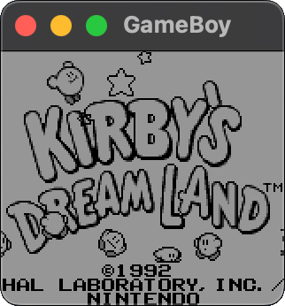

# gameboy-emulator
[comment]: <> (TOOD Add dynamically updating badges)


This is an implementation of the original Game Boy (DMG0) hardware written in C++.
It features a full CPU implementation and an approximate PPU implementation (no audio, yet). 
This project can be run standalone (using the provided SFML-based graphical interface)
or it can be incorporated in another project as a library. Here are some screenshots!

|   |  |  |  |
|:------------------------------------:|:---------------------------------------:|:-------------------------------------:|:-------------------------------------:|


## Features and Overview
The goal of this project was not to achieve perfect accuracy, but rather to
obtain a functioning implementation that can be easily improved upon. I have
approximated some aspects of the hardware and in some places
I have valued code clarity above raw performance. I expect most (supported) ROMs
to run fine in this emulator, possibly with some graphical glitches. Here is a brief
list of all the supported features. To understand the meaning of technical terms, please refer to the [hardware primer](#the-gameboy-hardware).

| Feature                      | Status  | Comment                                                                                                                                                                                    |
|------------------------------|:-------:|--------------------------------------------------------------------------------------------------------------------------------------------------------------------------------------------|
| CPU Instructions             |   🟢    | All CPU instructions have been implemented and they pass Blargg's `cpu_instrs` tests (see [Testing]).                                                                                      |
| Interrupts and timers        |   🟢    | CPU interrupts and timer have been implemented. Interrupts do pass Blargg's tests; tcu do not (see [Testing]).                                                                             |
| Savegames                    |   🟢    | Although very basic, the implementation of savegames (battery-backed cartridges) works correctly. Games are saved whenever the emulator window is closed.                                  |
| Performance                  |   🟢    | The DMG hardware is very simple and the emulator runs fast. Multithreading could be implemented easily to speed up performance even more.                                                  |
| Graphics                     |   🟠    | PPU Timings are machine-cycle accurate, but there is no FIFO implementation. Each scanline gets drawn all at once.                                                                         |
| Timing accuracy              |   🟠    | The time step of the emulator is one machine-cycle. CPU instructions are atomic but execution is still delayed by the correct amount of cycles.                                            | 
| ROM Loading                  |   🟠    | Only `MBC0`, `MBC1` and `MBC3` (without RTC hardware) cartridges are implemented. The code is set up to allow for easy addition of new cartridge types. Multicart ROMs are not supported!  |
| Serial                       |   🟠    | Only basic serial reading was implemented for debugging purposes.                                                                                                                          |
| Audio                        |   🔴    | No APU implementation yet.                                                                                                                                                                 |
| Hardware bugs and edge cases |   🔴    | Most of the original hardware's edge cases and bugs have not been implemented. Regardless, official ROMs should not depend on them in the first place.                                     |
| Savestates                   |   🔴    | The way the code is set up makes serializing the state a bit cumbersome. Regardless, I did not intend for savestates to be available in the first place.                                   |


## Building
### Dependencies

The emulator library does not use any external dependencies, apart from the standard
library. To build the standalone program, however, you will need:
- [Lyra](https://github.com/bfgroup/Lyra) (already bundled)
- [Doctest](https://github.com/onqtam/doctest) (already bundled)
- [SFML 2.6](http://www.sfml-dev.org/) (has to be installed manually)

The recommended way to build this code is by using [CMake](https://cmake.org/).
When testing and when writing new code, one should compile using the `Debug` configuration,
as it enables additional checks (`-fsanitize="address"`, code asserts, ...), disables optimization
and writes debugging symbols to the binary file. For the best performance, build using the `Release`
configuration. Bear in mind that code asserts are _disabled_ in the latter and they should not be relied
upon to handle control flow.

### Building the standalone emulator

```shell
# Clone the repo
git clone git@github.com:P2-718na/gameboy-emulator.git

# Create and cd to build directory
take gameboy-emulator/build

# Prepare build files. Use "Debug" instead of "Release" to build in debug mode.
cmake .. -DCMAKE_BUILD_TYPE=Release

# Build everything
make
```

This will configure all the needed files. Two executables will be generated
(see [Running] for additional information on what they do).

```bash
./gameboy   # Run standalone emulator

./test      # Run tests
```

### Building the emulator library
All the emulator code is contained in the `Gameboy` class and its dependencies. To use this
in your own CMake project, make sure to
1) add it as a source directory,
2) link it to your target and
3) add all the necessary include folders.
```cmake
# ...

ADD_SUBDIRECTORY(src)

# ...

TARGET_LINK_LIBRARIES(your_target Gameboy)

# ...

INCLUDE_DIRECTORIES(
        "${PROJECT_SOURCE_DIR}/src"
        "${PROJECT_SOURCE_DIR}/src/Frontend"
        "${PROJECT_SOURCE_DIR}/src/Gameboy"
        "${PROJECT_SOURCE_DIR}/src/CPU"
        "${PROJECT_SOURCE_DIR}/src/PPU"
        "${PROJECT_SOURCE_DIR}/src/TimerController"
        "${PROJECT_SOURCE_DIR}/src/AddressBus"
        "${PROJECT_SOURCE_DIR}/src/Cartridge"
)

# ...
```
The current organization of the include directories is a bit cumbersome and I am planning on improving it.
If you want to run Blargg's tests, make sure to also copy the test ROMs to the binary folder.

To learn how to use the `Gameboy` library, please refer to the [documentation]. 


### Building on different systems

The code was written on macOS Monterey (Apple clang 14.0.0) and it builds just fine on Linux.
Building on Windows and other systems should be just a matter of installing SFML and running CMake.

## Running
### Standalone emulator
The standalone emulator should be called with exactly one parameter: the path to the ROM file to be loaded
```bash
./emulator rom-name.gb
```
if the ROM file is of a battery-backed cartridge, a save file will be generated (if not already present)
in the same folder as the ROM, named `rom-name.gb.sav`. The save file will then be loaded
automatically every time the game is run. Please bear in mind that the ROM and the save file should
be kept in the same folder and should respect the naming convention that was just described here, in
order to be loaded correctly.

Running the emulator will open a window. Then, the user can interact with the emulator
using the following key bindings.

| Key     |       Game Boy button       |
|---------|:---------------------------:|
| Space   |              A              |
| Shift   |              B              |
| Enter   |            Start            |
| Escape  |           Select            |
| W/A/S/D | &uarr;/&larr;/&darr;/&rarr; |

### Tests
Here I am using the [Doctest] library to run tests. Currently, the tests consist of
a subset of [Blargg's test ROMs](https://gbdev.gg8.se/wiki/articles/Test_ROMs) and a series
of unit tests written by me. Not all methods are tested, but asserts are added throughout the
entire code base to check for possible mistakes in the development phase.

To launch the tests, run
```bash
./test
```
from the build directory. This will run both unit tests and the test ROMs, in order.
Please bear in mind that not all test ROMs will complete successfully: this is due to the
emulator approximations, and it is expected. Only the failure of critical test ROMs (such as `cpu_instrs`)
will report the tests as unsuccessful.

## Code structure

The code follows the basic principles of Object-Oriented Programming.
Each physical Game Boy component is implemented in its own separate class (`CPU`, `PPU`, `TimerController`).
Each component has
a `machineClock()` method (to be called each clock cycle) and has access to the shared `AddressBus` and to the
main `Gameboy` instance. The `Cartridge` class is an interface used to implement different
cartridge types. Finally, the `Frontend` class handles the interactions with the user and the environment.
The `Gameboy` class is to be intended as the public interface of the library, and additional documentation 
is available for it (see [Documentation]). The following table contains a summary of what each class does. 

| Class             | Description                                                                                                                                                                       |
|-------------------|-----------------------------------------------------------------------------------------------------------------------------------------------------------------------------------|
| `Frontend`        | Handles loading of ROMs and save files, graphical output, user input, and clocks the emulator.                                                                                    |
| `Gameboy`         | Container for all the Game Boy components. Handles interrupt requests and exposes methods that allow `Frontend` to read and change the status of the system (display, inputs...). |
| `AddressBus`      | Handles reads and writes from RAM, ROM and registers. All components of the Game Boy should have access to this.                                                                  |
| `Cartridge`       | Virtual base class that defines the interface that each cartridge type should have. Implementations of new cartridge hardware should be added as a derived class of this one.     |
| `CPU`             | Represents the physical Game Boy processor. Reads and executes instructions from the Address Bus.                                                                                 |
| `PPU`             | Represent the physical Game Boy graphics unit. Periodically updates the screen buffer and requests the necessary interrupts.                                                      |
| `TimerController` | Represent the physical Game Boy timer hardware. Consists of a series of counters that increment at each clock cycle and eventually request interrupts.                            |


## Additional notes

### Contributing

If you want to open a pull request, please see [CONTRIBUTING.md](CONTRIBUTING.md)

### Hardware primer

For a quick introduction to the DMG0's hardware, and the list of all the references I used for this project, see
[HARDWARE.md](HARDWARE.md)

### Documentation

Documentation is automatically generated for the `Gameboy` library. The documentation for
the latest release is available [here](TODO).

### On code clarity
I used several tools to make sure that my code is correct, clean and consistent.
Namely:

1. Clang-Format to check code formatting ([.clang-format][B]).
2. Clang-Tidy to check for common bad-practice warnings
   ([CLion default configuration][3]).
3. cpplint.py to check for some additional details that Clang-Tidy could not
   pick up ([Google styleguide][4]).

I also run the code through _Valgrind Memcheck_ and I made sure that there are
no memory-related errors in my code.

--------------------------------------------------------------------------------

[Doctest]: https://github.com/doctest/doctest

[2]: https://github.com/P2-718na
[3]: https://confluence.jetbrains.com/display/CLION/Clang-Tidy+in+CLion%3A+default+configuration?_ga=2.184137826.59717557.1623227743-1021145942.1623227743
[4]: https://google.github.io/styleguide/cppguide.html

[B]: .clang-format


[Building]: #building
[Running]: #running
[Testing]: #tests
[Documentation]: #documentation